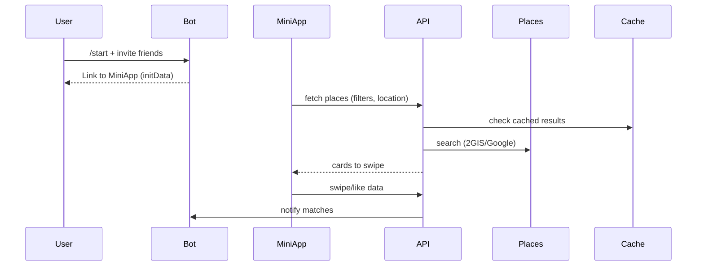

# Go Out Today — overview

```mermaid
sequenceDiagram
  participant User
  participant Bot
  participant MiniApp
  participant API
  participant Places
  participant Cache

  User->>Bot: /start + invite friends
  Bot-->>User: Link to MiniApp (initData)
  MiniApp->>API: fetch places (filters, location)
  API->>Cache: check cached results
  API->>Places: search (2GIS/Google)
  API-->>MiniApp: cards to swipe
  MiniApp->>API: swipe/like data
  API->>Bot: notify matches
```
